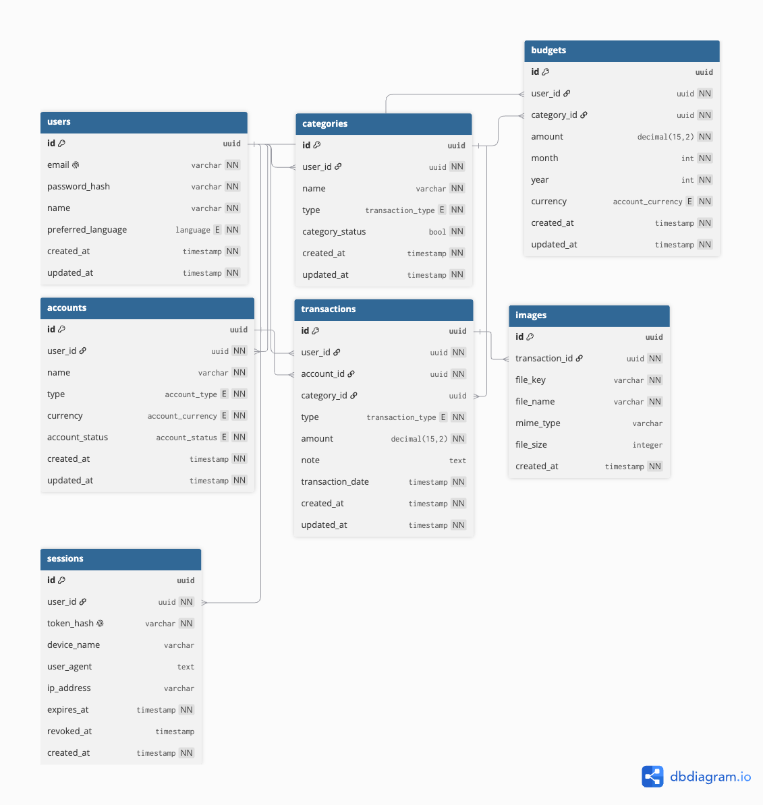

# FlowPocket

FlowPocket คือ REST API สำหรับจัดการรายรับ รายจ่าย และงบประมาณส่วนบุคคล ผู้ใช้สามารถจัดการบัญชีทางการเงิน บันทึกธุรกรรม แบ่งหมวดหมู่ กำหนดงบประมาณ และดูรายงานสรุปตามบัญชีหรือช่วงเวลาได้

พัฒนาด้วย TypeScript, Fastify, TypeORM และ PostgreSQL

## ฟีเจอร์ที่พัฒนาแล้ว

### Authentication และ Session (ระบบ Login)

- สมัครสมาชิกและเข้าสู่ระบบ
- Hash รหัสผ่านก่อนจัดเก็บ
- Authentication ด้วย session token
- จัดเก็บข้อมูลอุปกรณ์และ IP ของ session
- ออกจากระบบโดย revoke session

### Account (ระบบ เพิ่ม ลบ บัญชีใช้จ่าย)

- สร้างและแก้ไขบัญชีทางการเงิน
- ปิดใช้งานบัญชีแบบ soft delete
- แสดงยอดเงินตามรายการธุรกรรม
- จำกัดการเข้าถึงบัญชีตามเจ้าของข้อมูล

### Category (ระบบเพิ่ม ลบ ประเภทของการใช้จ่าย)

- สร้างและจัดการหมวดหมู่รายรับ–รายจ่าย
- ตรวจสอบประเภทหมวดหมู่กับประเภทธุรกรรม
- ปิดใช้งานหมวดหมู่แบบ soft delete

### Transaction (ระบบบันทึกรายรับรายจ่าย)

- บันทึกรายรับและรายจ่าย
- กรองรายการตามบัญชี หมวดหมู่ ประเภท และวันที่
- รองรับ pagination
- แนบรูปภาพกับธุรกรรม
- กรองคำที่ไม่เหมาะสมจากหมายเหตุ

### Budget (ระบบกำหนดงบประมาณ, เฉลี่ยเงิน)

- กำหนดงบประมาณตามหมวดหมู่และช่วงเวลา
- ป้องกันการสร้างงบประมาณซ้ำตามเงื่อนไขที่กำหนด
- เปรียบเทียบงบประมาณกับค่าใช้จ่ายจริง

### Report (ระบบสรุปยอดใช้จ่าย)

- สรุปรายรับ รายจ่าย และกระแสเงินสดสุทธิ
- สรุปค่าใช้จ่ายตามหมวดหมู่
- กรองตามเดือน ปี ช่วงวันที่ และบัญชี
- คำนวณงบประมาณและวงเงินที่ใช้ได้ต่อวัน

### Internationalization (ระบบรองรับหลายภาษา)

- รองรับข้อความตอบกลับจาก API ภาษาไทยและภาษาอังกฤษ
- แยก translation resources ตามภาษา
- รองรับข้อความจาก controller, validation และ error handling
- สามารถเพิ่มภาษาใหม่ได้โดยไม่กระทบ business logic

## แนวคิดในการออกแบบ

FlowPocket แบ่งโครงสร้างโปรเจกต์ออกเป็น Route, Schema, Controller, Entity, Plugin และ Utility เพื่อให้แต่ละส่วนมีหน้าที่ชัดเจน และง่ายต่อการดูแลหรือต่อยอด.

### Separation of Concerns

ระบบแยกหน้าที่ของแต่ละส่วนดังนี้:

- **Route** กำหนด endpoint และ middleware ที่ต้องใช้งาน
- **Schema** ตรวจสอบความถูกต้องของ request ด้วย Joi
- **Controller** ควบคุมลำดับการทำงานและ business logic
- **Entity** กำหนดโครงสร้างข้อมูลและความสัมพันธ์ในฐานข้อมูล
- **Plugin** จัดการความสามารถที่ใช้ร่วมกัน เช่น authentication และ Cloudflare R2 (S3-compatible API)
- **Utility** รวม logic ที่นำกลับมาใช้ซ้ำ เช่น response, date และ validation

### Authentication และ Data Ownership

ระบบใช้ session token สำหรับยืนยันตัวตน โดยจัดเก็บ token ในรูปแบบ hash แทนการเก็บ token ต้นฉบับในฐานข้อมูล หลังผ่าน authentication ระบบจะนำ `userId` จาก session มาใช้ตรวจสอบ ownership ของ Account, Category, Transaction และ Budget ทุกครั้ง แทนการเชื่อถือ `userId` ที่ส่งมาจาก client วิธีนี้ช่วยป้องกันผู้ใช้ เข้าถึงหรือแก้ไขข้อมูลของผู้ใช้อื่น

### Input Validation

Request parameters, query string และ request body ถูกตรวจสอบด้วย Joi ก่อนเข้าสู่ business logic เพื่อให้ API ปฏิเสธข้อมูลที่ผิดรูปแบบตั้งแต่ต้น และส่งข้อความ error ที่มีรูปแบบเหมือนกัน

### Data Integrity

ระบบกำหนด `synchronize: false` และใช้ TypeORM migration ในการจัดการ การเปลี่ยนแปลง schema แทนการให้ ORM แก้ไขฐานข้อมูลโดยอัตโนมัติ แนวทางนี้ช่วยลดความเสี่ยงจากการเปลี่ยนหรือลบ column, constraint และข้อมูลโดยไม่ตั้งใจ

ระบบใช้ database constraints ร่วมกับ application validation เพื่อรักษาความถูกต้องของข้อมูลและป้องกันข้อมูลที่ไม่ควรซ้ำ

### Soft Delete

Account และ Category ใช้วิธีเปลี่ยนสถานะแทนการลบ record ออกจาก ฐานข้อมูล เพื่อรักษาประวัติและความสัมพันธ์กับ Transaction เดิม

### Standard API Response

API ใช้โครงสร้าง response กลางสำหรับผลลัพธ์สำเร็จและข้อผิดพลาด เพื่อให้ client ประมวลผลข้อมูลได้อย่างสม่ำเสมอ และไม่ต้องรองรับ response shape ที่แตกต่างกันในแต่ละ endpoint

### Internationalization

ข้อความสำเร็จ ข้อความ validation และ error message อ้างอิงผ่าน translation key โดยใช้ i18next แทนการเขียนข้อความไว้ใน business logic โดยตรง ปัจจุบันระบบรองรับภาษาไทยและภาษาอังกฤษ และสามารถเพิ่มภาษาใหม่ ผ่าน translation resource โดยไม่ต้องเปลี่ยนขั้นตอนการทำงานหลัก

## Technology

FlowPocket พัฒนาเป็น RESTful API โดยใช้ TypeScript และ Fastify เชื่อมต่อฐานข้อมูล PostgreSQL ผ่าน TypeORM โครงสร้างโปรเจกต์แบ่งตาม หน้าที่ของแต่ละส่วน เพื่อให้ค้นหา แก้ไข และต่อยอดระบบได้ง่ายขึ้น

| Technology                        | การใช้งาน                                                                   |
| --------------------------------- | --------------------------------------------------------------------------- |
| Node.js                           | Runtime สำหรับ API server                                                   |
| TypeScript                        | เพิ่ม static type checking และลดข้อผิดพลาดระหว่างพัฒนา                      |
| Fastify                           | HTTP framework สำหรับกำหนด routes, hooks และ plugins                        |
| PostgreSQL                        | ฐานข้อมูลเชิงสัมพันธ์สำหรับข้อมูลผู้ใช้และข้อมูลทางการเงิน                  |
| TypeORM                           | จัดการ entities, relationships, queries และ migrations                      |
| Joi                               | ตรวจสอบ request body, parameters และ query string                           |
| i18next                           | จัดการข้อความตอบกลับภาษาไทยและภาษาอังกฤษ                                    |
| bcrypt                            | Hash และตรวจสอบรหัสผ่าน                                                     |
| Cloudflare R2 (S3-compatible API) | จัดเก็บรูปภาพที่แนบกับธุรกรรม                                               |
| Docker และ Docker Compose         | Containerize API และ PostgreSQL เพื่อให้สามารถรันระบบได้ในแต่ละ environment |

## Architecture

```text
HTTP Request
     │
     ▼
Route ──► Authentication
     │
     ▼
Validation
     │
     ▼
Controller
     │
     ▼
TypeORM ──► PostgreSQL
     │
     ▼
Standard Response

```

## Project Structure

```text
src/
├── controllers/   # Business logic และการจัดรูปแบบ response
├── routes/        # Endpoint definitions และ route-level hooks
├── schemas/       # Request validation schemas
├── entities/      # TypeORM entities และ database relationships
├── migrations/    # ประวัติการเปลี่ยนแปลง database schema
├── plugins/       # Fastify plugins เช่น authentication และ Cloudflare R2 (S3-compatible API)
├── utils/         # Shared utilities เช่น date, validation และ response
├── locales/       # Translation resources ภาษาไทยและอังกฤษ
├── data/          # Static application data
├── app.ts         # สร้างและตั้งค่า Fastify application
├── index.ts       # Application entry point
└── data-source.ts # TypeORM DataSource configuration
```

## Database Design



ความสัมพันธ์หลัก:

- User มีได้หลาย Account
- Account มีได้หลาย Transaction
- Category มีได้หลาย Transaction
- Transaction มี Image ได้หลายรายการ
- User สามารถกำหนด Budget ตาม Category ได้หลายรายการ
- User มีได้หลาย Session

## Setup

สร้างไฟล์ environment ก่อนเริ่มระบบ:

```bash
cp .env.example .env
```

แก้ไขค่าใน `.env` แล้วสร้างและเริ่ม API พร้อม PostgreSQL:

```bash
docker compose up --build
```

API จะพร้อมใช้งานที่ `http://localhost:8080` โดย application container
จะรอให้ PostgreSQL พร้อมและรัน TypeORM migration ก่อนเริ่ม API

หยุดระบบด้วยคำสั่ง:

```bash
docker compose down
```

ข้อมูล PostgreSQL จะยังอยู่ใน Docker volume `postgres_data`
หากต้องการลบข้อมูลด้วย ให้ใช้ `docker compose down --volumes`

### Useful Docker Commands

    # เริ่มระบบ
    docker compose up --build

    # เริ่มแบบ background
    docker compose up -d --build

    # ดูสถานะ
    docker compose ps

    # ดู log ทั้งระบบ
    docker compose logs -f

    # ดูเฉพาะ API
    docker compose logs -f app

    # หยุดและลบ containers/network
    docker compose down

## Migration

### Generate Migration File

    npm run typeorm -- migration:generate src/migrations/AddUniqueConstraintBudget -d ./src/data-source-migration.ts

### Run Migration File

    npm run typeorm -- migration:run -d ./src/data-source-migration.ts

### Generate token secret

    openssl rand -base64 48

### Environment Variables

| Variable               | Description                                                   |         Required |
| ---------------------- | ------------------------------------------------------------- | ---------------: |
| `PORT`                 | Port ที่เปิด API บนเครื่อง host                               |               No |
| `POSTGRES_HOST`        | PostgreSQL host                                                |              Yes |
| `POSTGRES_USER`        | PostgreSQL username                                           |              Yes |
| `POSTGRES_PASSWORD`    | PostgreSQL password                                           |              Yes |
| `POSTGRES_DB`          | ชื่อฐานข้อมูล                                                 |              Yes |
| `POSTGRES_PORT`        | PostgreSQL port บนเครื่อง host                                |              Yes |
| `SESSION_TOKEN_SECRET` | Secret สำหรับ hash session token ความยาวอย่างน้อย 32 ตัวอักษร |              Yes |
| `S3_ACCOUNT_ID`        | Cloudflare account ID                                         | For image upload |
| `S3_ACCESS_KEY_ID`     | Object storage access key                                     | For image upload |
| `S3_SECRET_ACCESS_KEY` | Object storage secret key                                     | For image upload |
| `S3_BUCKET_NAME`       | Bucket name                                                   | For image upload |
| `S3_PUBLIC_URL`        | Public URL ของ bucket                                         | For image upload |

## API Documents

https://joint-operations-astronomer-80953780-s-team.docs.buildwithfern.com/flow-pocket/auth/me

## Future Improvements

### Automated Testing

เพิ่ม integration tests สำหรับ authentication, data ownership, transaction, budget และ report calculation พร้อมแยก test database ออกจาก development environment

### Service Layer

แยก business logic และ database query ออกจาก controller ไปยัง service layer เพื่อลดความซ้ำซ้อนและทำให้ทดสอบได้ง่ายขึ้น

### Report Export

เพิ่มการ export รายงานเป็น CSV, JSON และ Excel รวมถึงรองรับ Google Sheets ในอนาคต

### Security และ Observability

เพิ่ม rate limiting, login attempt protection และ error monitoring สำหรับการใช้งานใน production

### CI/CD และ Deployment

เพิ่ม pipeline สำหรับ type checking, linting, automated testing, production build และ Docker image build รวมถึงแยก database migration เป็น deployment job เมื่อระบบรองรับหลาย application replicas
